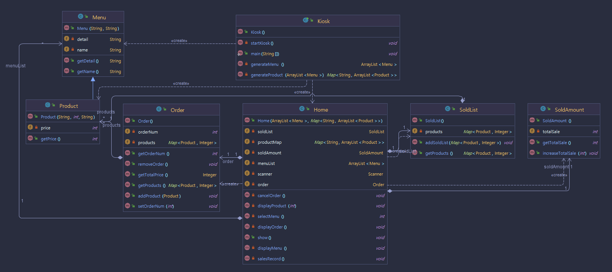

햄버거 키오스크 프로그램  
1. 메뉴판을 보고 주문할 수 있는 Java 프로그램
2. 화면은 System.out.println() 메소드를 사용해서 심플하게 출력  

메인 메뉴판 화면  
    - 메인 메뉴판이 출력되며 메뉴판에는 상품 메뉴가 출력됩니다.  
    - 상품 메뉴는 간단한 설명과 함께 출력되며 최소 3개 이상 출력됩니다.  
    - 상품 메뉴 아래에는 Order(주문)와 Cancel(주문취소) 옵션을 출력해줍니다.  

상품 메뉴판 화면  
    - 상품 메뉴 선택시 해당 카테고리의 메뉴판이 출력됩니다.  
    - 메뉴판에는 각 메뉴의 이름과 가격과 간단한 설명이 표시됩니다.  

구매 화면  
    - 상품 선택시 해당 상품을 장바구니에 추가할지 확인하는 문구가 출력됩니다.  
    - `1.확인` 입력시 장바구니에 추가되었다는 안내문구와 함께 메인메뉴로 다시 출력됩니다.  

주문 화면  
    - `5.Order` 입력시 장바구니 목록을 출력해줍니다.  
    - 장바구니에서는 추가된 메뉴들과 총 가격의 합을 출력해줍니다.  
    - `1.주문` 입력시 주문완료 화면으로 넘어가고, `2.메뉴판` 입력시 다시 메인메뉴로 돌아옵니다.  

주문완료 화면  
    - `1.주문` 입력시 대기번호를 발급해줍니다.  
    - 장바구니는 초기화되고 3초후에 메인 메뉴판으로 돌아갑니다.  

주문취소 화면  
    - 메뉴판에서 `6.Cancel` 입력시 주문을 취소할지 확인을 요청하는 문구가 출력됩니다.  
    - `1.확인` 을 입력하면 장바구니는 초기화되고 취소 완료 문구와 함께 메뉴판이 출력됩니다.  

판매기록 조회 화면  
    - 구매가 완료될때마다 총 판매 금액, 판매 상품 목록을 누적해줍니다.  
    - 0번 입력시 총 판매금액을 출력합니다.   
